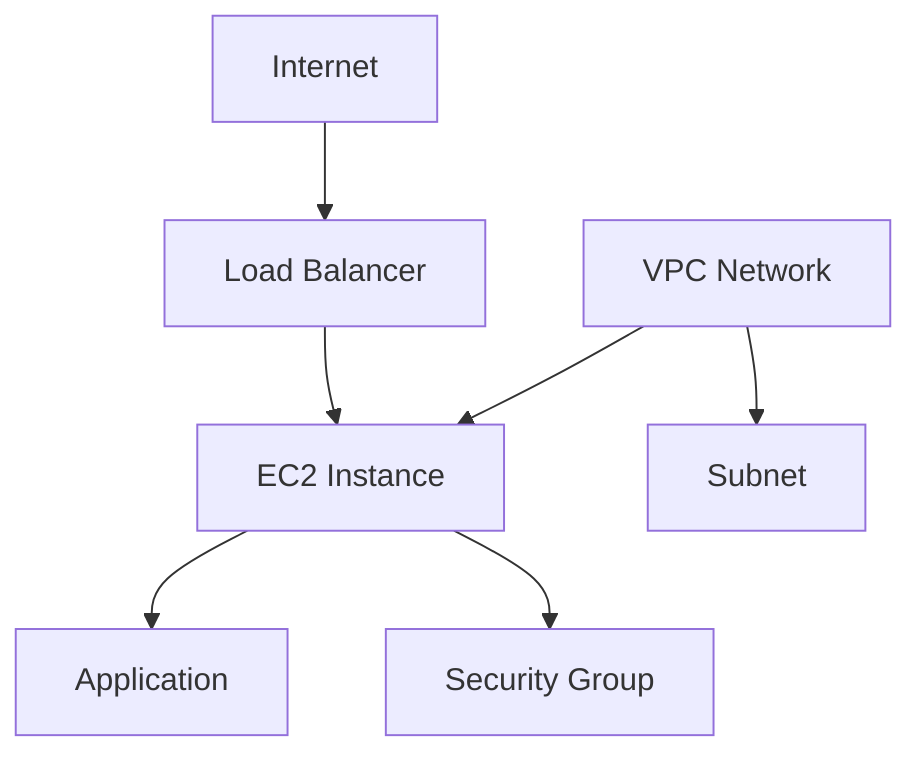

## AWS Infrastructure Architecture

```mermaid
flowchart TD
A[Internet] --> B[Load Balancer]
B --> C[EC2 Instance]
C --> D[Application]
C --> E[Security Group]
F[VPC Network] --> C
F --> G[Subnet]
```
